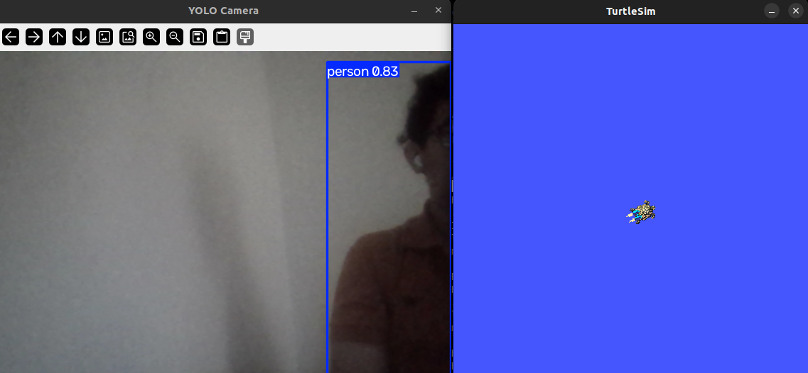
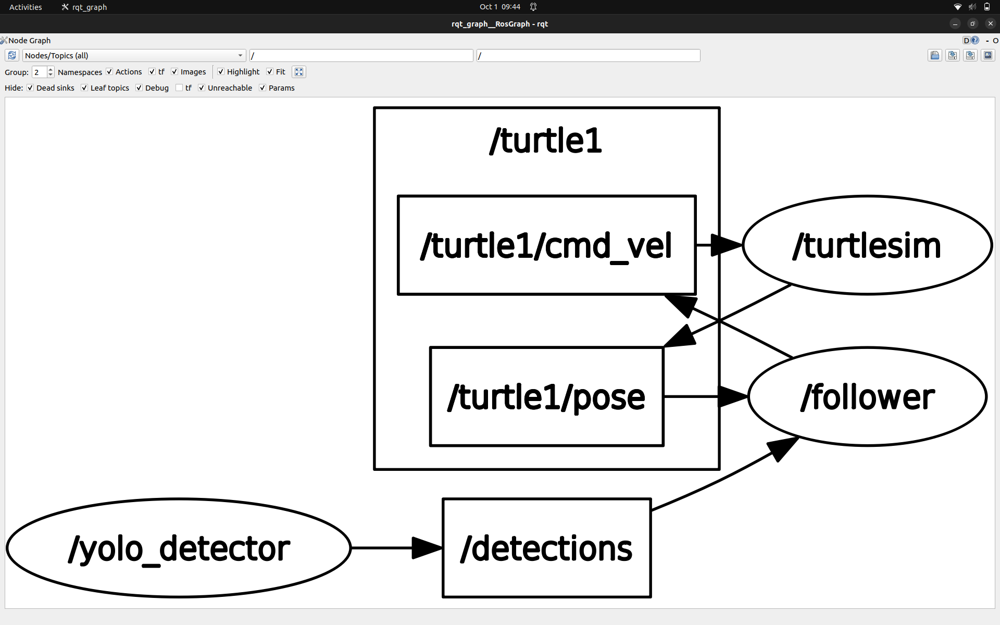
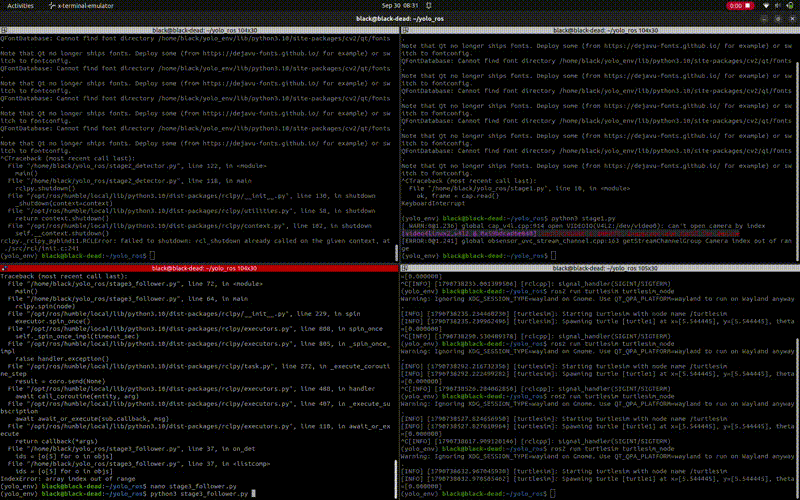

# Vision-Based Human Following Robot Simulation Using ROS2 and YOLOv8

## Overview

This project presents a vision-based human following robot simulation developed using **ROS2, YOLOv8, OpenCV, and closed-loop control**.

The objective of this project is to create a robotic system that can detect a human target using a camera, process the visual information, and control the robot's movement direction according to the detected target position.

The current implementation uses **TurtleSim as a simulation platform** to validate the perception and control pipeline. This project demonstrates the integration of computer vision, robotics middleware, and control systems.

---

## System Architecture

The complete workflow of the system:

```
Camera Input
      |
      v
YOLOv8 Human Detection
      |
      v
ROS2 Detection Node
      |
      v
Target Position Processing
      |
      v
Closed-Loop Heading Controller
      |
      v
Robot Motion Command
      |
      v
TurtleSim Robot
```

---

## Features

- Real-time human detection using YOLOv8
- ROS2-based communication architecture
- Camera-based perception system
- OpenCV image processing
- Closed-loop heading control
- Real-time target position estimation
- ROS2 publisher/subscriber communication
- Adjustable controller parameters
- Safety watchdog mechanism

---

## Technologies Used

### Software

- ROS2 Humble
- Python
- OpenCV
- YOLOv8 (Ultralytics)
- PyTorch
- TurtleSim

### Concepts Implemented

- Computer Vision
- Robot Perception
- ROS2 Nodes and Topics
- Feedback Control Systems
- Autonomous Robot Behaviour

---

## Working Principle

### 1. Human Detection

The system uses a webcam to capture real-time video frames.

YOLOv8 processes these frames and detects human targets by providing:

- Bounding box coordinates
- Target position
- Detection confidence

The detected information is published through ROS2 topics for further processing.

---

### 2. ROS2 Communication

The project uses ROS2 nodes for modular communication.

Detection information is published through:

```
/detections
```

Annotated camera output is published through:

```
/image_annotated
```

---

### 3. Closed-Loop Control

The controller receives the detected human position and calculates the required robot heading.

The desired heading is compared with the robot's current orientation, and velocity commands are generated to reduce the error.

This creates a feedback-based closed-loop control system.

---

## Repository Structure

```
vision-based-human-following-robot/

├── LICENSE
├── media/
│   ├── demo.gif
│   ├── ros_graph.png
│   ├── yolo_detection_left.png
│   └── yolo_detection_right.png
│
├── README.md
├── requirements.txt
│
└── src/
    ├── stage1.py
    ├── stage2_detector.py
    └── stage3_follower.py
```

---

## Installation

### Clone Repository

```bash
git clone https://github.com/izhaan-mubeen/vision-based-human-following-robot.git
cd vision-based-human-following-robot
```

### Install Dependencies

```bash
sudo apt install python3-venv ros-$ROS_DISTRO-turtlesim ros-$ROS_DISTRO-rqt-image-view
pip install -r requirements.txt
```

### Source ROS2

```bash
source /opt/ros/humble/setup.bash
```

---

## Running the Project

### Optional: Stage 1 — Standalone Test (no ROS2)

Before running the full pipeline, `stage1.py` can be used to check that the
webcam and YOLO detection work correctly on their own, with no ROS2 involved.
This is a quick sanity check, not part of the actual robot pipeline.

```bash
python3 src/stage1.py
```

A window opens showing the live webcam feed with detection boxes and FPS.
Press `q` to close it. Once this works, move on to the full pipeline below.

### Terminal 1

Start TurtleSim:

```bash
ros2 run turtlesim turtlesim_node
```

### Terminal 2

Run YOLO Detection Node:

```bash
python3 src/stage2_detector.py
```

### Terminal 3

Run Controller Node:

```bash
python3 src/stage3_follower.py
```
---

## Demonstration

### YOLOv8 Human Detection




### ROS2 Node Communication




### System Demo


---

## Results

The system demonstrates:

- Real-time human detection
- ROS2 node communication
- Target position extraction
- Robot heading adjustment according to human position

The simulated robot changes its direction based on the detected target location.

---

## Future Improvements

### Hand Gesture Based Robot Control

The next development phase will replace body-based detection with hand tracking.

The robot will interpret hand direction and follow the indicated direction instead of only using body position.

### Real Mobile Robot Deployment

The simulation can be transferred to a physical mobile robot platform.

Future implementation may include:

- Differential drive robot
- Real camera integration
- Motor control
- ROS2 Navigation Stack

### Advanced Tracking

Future improvements:

- YOLO tracking
- ByteTrack integration
- Kalman filtering
- Improved target locking
- Multiple target handling

### Autonomous Navigation

Future integration:

- SLAM
- Obstacle avoidance
- Path planning
- Autonomous navigation

---

## Learning Outcomes

This project helped in understanding:

- ROS2 robotics framework
- Computer vision-based robot perception
- Real-time object detection
- Feedback control implementation
- Autonomous robotic systems

---

## Author

**Izhaan Mubeen**

Mechatronics and Control Engineering Student

Interested in Robotics, Automation, Computer Vision, and Control Systems

---

## License

This project is open-source and available for educational and research purposes.
